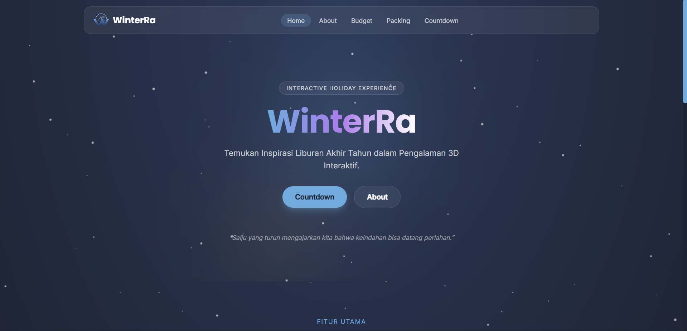
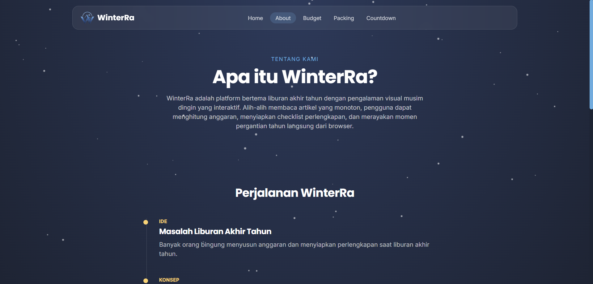
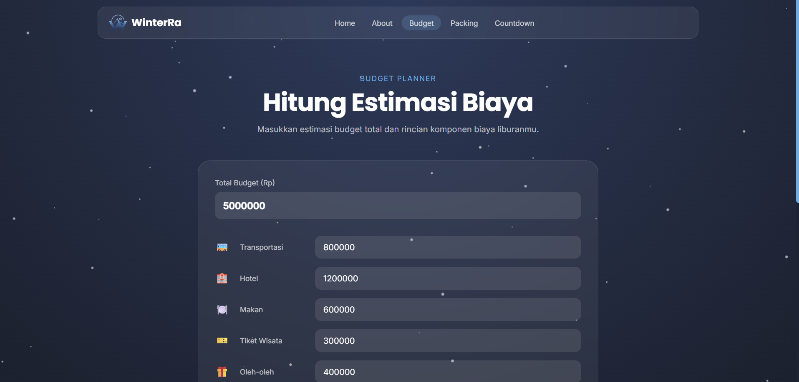
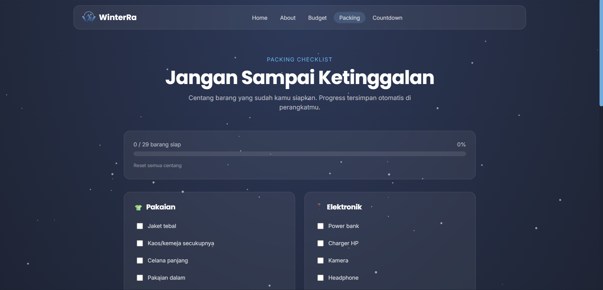
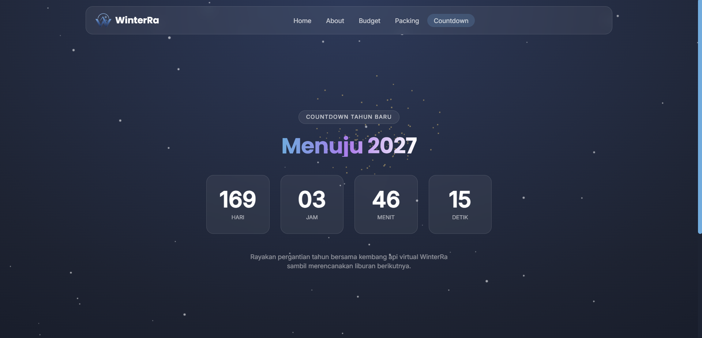

# ❄️ WinterRa

<div align="center">


**Interactive Holiday Experience — Rayakan Liburan Akhir Tahun dalam Pengalaman 3D Interaktif**

</div>

---

## 📋 Deskripsi Proyek

**WinterRa** adalah platform web bertema liburan akhir tahun yang mengganti artikel wisata yang monoton dengan pengalaman visual musim dingin yang interaktif. Alih-alih sekadar membaca tips liburan, pengguna dapat langsung menghitung anggaran, menyiapkan checklist perlengkapan, dan merayakan momen pergantian tahun dengan animasi kembang api 3D, semuanya berjalan sepenuhnya di browser tanpa backend maupun API eksternal.

Dibangun dengan Vue 3, Vite, Tailwind CSS, Three.js, dan GSAP, WinterRa menyediakan:

- Budget Calculator untuk estimasi biaya liburan (transportasi, hotel, makan, tiket, oleh-oleh)
- Packing Checklist interaktif dengan progress yang tersimpan otomatis di perangkat pengguna
- Countdown Tahun Baru dengan latar belakang kembang api 3D yang dirender menggunakan Three.js
- Efek salju turun yang menghiasi seluruh halaman
- Halaman About dan Credits yang menjelaskan latar belakang serta teknologi di balik proyek

---

## 📑 Daftar Isi

- [Deskripsi Proyek](#-deskripsi-proyek)
- [Tampilan Aplikasi](#-tampilan-aplikasi)
- [Latar Belakang](#-latar-belakang)
- [Fitur Utama](#-fitur-utama)
- [Teknologi yang Digunakan](#-teknologi-yang-digunakan)
- [Arsitektur](#-arsitektur)
- [Struktur Proyek](#-struktur-proyek)
- [Cara Instalasi](#-cara-instalasi)
- [Cara Penggunaan](#-cara-penggunaan)
- [Peran Developer](#-peran-developer)
- [Pembelajaran dari Proyek](#-pembelajaran-dari-proyek-lessons-learned)
- [Lisensi](#-lisensi)
- [Ucapan Terima Kasih](#-ucapan-terima-kasih)

---

## 📸 Tampilan Aplikasi

### Halaman Home



### Halaman About



### Halaman Budget



### Halaman Packing



### Halaman Countdown



---

## 🎯 Latar Belakang

Proyek ini lahir dari pengamatan bahwa kebanyakan orang menghadapi masalah yang sama menjelang liburan akhir tahun, yaitu bingung menyusun anggaran dan sering ada perlengkapan yang tertinggal. Beberapa kebutuhan yang melatarbelakangi pembuatan WinterRa:

- **Perencanaan liburan yang tersebar**. Estimasi biaya dan daftar bawaan biasanya dicatat manual di catatan terpisah, sehingga dibutuhkan satu tempat terpadu untuk merencanakan semuanya
- **Pengalaman yang membosankan**. Kebanyakan situs bertema liburan hanya berupa artikel statis, padahal momen akhir tahun bisa disampaikan lewat pengalaman visual yang lebih hidup
- **Kebutuhan alat yang ringan tanpa server**. Tidak semua orang butuh akun atau backend hanya untuk menghitung budget dan mencentang checklist; cukup berjalan di browser dan tersimpan di perangkat sendiri
- **Momen pergantian tahun yang layak dirayakan secara digital**. Countdown dengan visual kembang api 3D memberi sentuhan perayaan yang tidak didapat dari countdown timer biasa

---

## 🌟 Fitur Utama

### 🏠 Landing
| Fitur | Deskripsi |
|-------|-----------|
| Hero Section | Judul dan tagline WinterRa dengan animasi reveal menggunakan GSAP |
| Kutipan Harian | Kutipan inspiratif liburan yang berganti setiap hari, diambil dari `quotes.json` |
| Kartu Fitur | Tautan cepat ke Budget Calculator, Packing Checklist, dan Countdown |
| Highlight Keunggulan | Ringkasan keunggulan: frontend-only, desain winter modern, data tersimpan lokal |

### 💰 Budget Calculator
| Fitur | Deskripsi |
|-------|-----------|
| Input Total Budget | Pengguna menentukan batas anggaran liburan dalam Rupiah |
| Rincian Komponen Biaya | Input terpisah untuk transportasi, hotel, makan, tiket wisata, dan oleh-oleh |
| Progress Bar Dinamis | Visualisasi persentase anggaran yang terpakai, berubah warna saat melebihi batas |
| Format Rupiah Otomatis | Angka diformat sebagai mata uang Rupiah menggunakan `Intl.NumberFormat` |

### 🎒 Packing Checklist
| Fitur | Deskripsi |
|-------|-----------|
| Checklist per Kategori | Daftar perlengkapan dikelompokkan per kategori, dimuat dari `packing.json` |
| Progress Tracker | Menampilkan jumlah barang yang sudah dicentang dari total keseluruhan |
| Persistensi via Pinia | Status centang disimpan di localStorage lewat Pinia store agar tidak hilang saat refresh |
| Reset Checklist | Tombol untuk menghapus seluruh status centang sekaligus |

### 🎆 Countdown Tahun Baru
| Fitur | Deskripsi |
|-------|-----------|
| Hitung Mundur Real-time | Menampilkan hari, jam, menit, dan detik menuju 1 Januari tahun berikutnya |
| Kembang Api 3D | Animasi ledakan kembang api yang dirender dengan Three.js sebagai latar belakang |
| Pesan Perayaan | Pesan spesial otomatis muncul saat hitung mundur mencapai nol |

### ℹ️ About & Credits
| Fitur | Deskripsi |
|-------|-----------|
| Timeline Perjalanan | Narasi proses lahirnya WinterRa dari ide hingga hasil akhir, dengan animasi scroll GSAP |
| Kartu Keunggulan | Penjelasan singkat kelebihan teknis platform |
| Daftar Teknologi | Rincian seluruh library dan tools yang digunakan beserta fungsinya |

### ❄️ Pengalaman Visual Global
| Fitur | Deskripsi |
|-------|-----------|
| Snow Overlay | Efek salju turun secara halus di seluruh halaman menggunakan Canvas 2D |
| Smooth Scroll | Scroll yang mulus di seluruh aplikasi menggunakan Lenis |
| Transisi Halaman | Animasi fade saat berpindah antar route |

---

## 🛠️ Teknologi yang Digunakan

### Core Technologies
| Teknologi | Fungsi | Versi |
|-----------|--------|-------|
| **Vue.js 3** | Framework utama dengan Composition API (`<script setup>`) | ^3.5.39 |
| **Vue Router 4** | Navigasi SPA dengan history mode dan lazy loading | ^4.6.4 |
| **Vite** | Build tool dan dev server | ^8.1.1 |
| **Tailwind CSS 4** | Utility-first CSS framework dengan konfigurasi berbasis `@theme` di CSS | ^4.3.2 |
| **Pinia** | State management resmi Vue untuk store checklist packing | ^3.0.4 |
| **Three.js** | Rendering WebGL untuk animasi kembang api 3D di halaman Countdown | ^0.185.1 |
| **GSAP** | Animasi reveal dan scroll-trigger di berbagai halaman | ^3.15.0 |
| **Lenis** | Smooth scrolling di seluruh aplikasi | ^1.3.25 |

### Dev Dependencies
| Library | Fungsi |
|---------|--------|
| **@vitejs/plugin-vue** | Plugin Vite untuk kompilasi Vue SFC |
| **@tailwindcss/postcss** | Integrasi Tailwind CSS 4 dengan PostCSS |
| **PostCSS & Autoprefixer** | Transformasi dan vendor prefix CSS |

### Fonts & Assets
| Package | Fungsi |
|---------|--------|
| **@fontsource/poppins** | Font heading (bobot 600 & 700) |
| **@fontsource/inter** | Font body (bobot 400 & 500) |

### Web API
| API | Fungsi |
|-----|--------|
| **localStorage** | Persistensi status checklist packing via Pinia store |
| **Canvas 2D API** | Rendering efek salju (`SnowOverlay.vue`) |
| **Fetch API** | Memuat data statis `quotes.json` dan `packing.json` dari folder `public/data` |

---

## 🏗️ Arsitektur

### Pola Desain yang Digunakan

- **Component-based Architecture**. Setiap section halaman dan elemen visual dikemas dalam komponen Vue yang terpisah
- **Single File Components (SFC)**. Template, script, dan style dalam satu file `.vue` menggunakan `<script setup>`
- **Composition API + Composables**. Logika reusable seperti `useFireworks`, `useJsonData`, dan `useLenis` diekstrak menjadi composable functions
- **Centralized State dengan Pinia**. Status checklist packing dikelola lewat store terpusat (`stores/packing.js`) dan dipersist ke localStorage
- **Data-driven Content**. Konten dinamis (kutipan, daftar packing) dipisahkan ke file JSON statis di `public/data`, bukan di-hardcode dalam komponen
- **Lazy Loading Routes**. Setiap halaman di-load secara dinamis lewat `import()` di router untuk performa awal yang lebih baik

---

## 📁 Struktur Proyek

```
winterra/
│
├── index.html                    # Entry point HTML
├── package.json                  # Konfigurasi proyek dan dependensi
├── vite.config.js                # Konfigurasi Vite
├── postcss.config.js             # Konfigurasi PostCSS
│
├── public/
│   ├── favicon.png                # Favicon aplikasi
│   ├── icons.svg                  # Sprite ikon
│   └── data/
│       ├── packing.json           # Data kategori & item packing checklist
│       └── quotes.json            # Data kutipan liburan harian
│
└── src/
    ├── main.js                   # Entry point Vue — inisialisasi app, Pinia, dan router
    ├── App.vue                   # Root component — layout global (NavBar, SnowOverlay, Footer)
    ├── style.css                 # Global styles & Tailwind v4 theme tokens
    │
    ├── router/
    │   └── index.js              # Definisi route (Landing, About, Budget, Packing, Countdown, Credits)
    │
    ├── stores/
    │   └── packing.js            # Pinia store untuk status checklist packing (localStorage)
    │
    ├── composables/
    │   ├── useFireworks.js       # Logika animasi kembang api 3D (Three.js)
    │   ├── useJsonData.js        # Fetch data JSON statis dari public/data
    │   └── useLenis.js           # Inisialisasi smooth scroll (Lenis)
    │
    ├── views/                    # Halaman-halaman utama (route-level components)
    │   ├── LandingView.vue
    │   ├── AboutView.vue
    │   ├── BudgetView.vue
    │   ├── PackingView.vue
    │   ├── CountdownView.vue
    │   └── CreditsView.vue
    │
    ├── components/
    │   ├── layout/
    │   │   ├── NavBar.vue         # Navigasi utama dengan menu responsif
    │   │   └── SiteFooter.vue     # Footer global
    │   └── three/
    │       └── SnowOverlay.vue    # Efek salju turun (Canvas 2D)
    │
    └── assets/
        ├── hero.png
        └── logo WinterRa.png
```

### Penjelasan File & Folder Utama

| Path | Fungsi |
|------|--------|
| [src/main.js](src/main.js) | Inisialisasi Vue app, registrasi Pinia & router, mounting ke DOM |
| [src/App.vue](src/App.vue) | Root component yang mengatur layout global dan transisi antar halaman |
| [src/router/index.js](src/router/index.js) | Konfigurasi seluruh route dengan lazy loading per halaman |
| [src/stores/packing.js](src/stores/packing.js) | Pinia store: toggle item, cek status, dan reset checklist ke localStorage |
| [src/composables/useFireworks.js](src/composables/useFireworks.js) | Setup scene, camera, dan animasi ledakan partikel Three.js untuk halaman Countdown |
| [src/style.css](src/style.css) | Definisi warna, font, dan utility custom (`.glass`, `.text-gradient`, `.bg-winter-gradient`) via Tailwind v4 `@theme` |

---

## 📥 Cara Instalasi

### Prasyarat

- **Node.js 18+** — Runtime JavaScript
- **npm** — Package manager

### Langkah-langkah

**1. Masuk ke folder proyek**

```bash
cd winterra
```

**2. Install Dependensi**

```bash
npm install
```

**3. Jalankan Development Server**

```bash
npm run dev
```

**4. Build untuk Produksi**

```bash
npm run build
```

**5. Preview Build Produksi**

```bash
npm run preview
```

---

## 🎮 Cara Penggunaan

### Navigasi Halaman

Gunakan NavBar di bagian atas untuk berpindah antar halaman:
- **Home** : Halaman utama dengan overview platform dan kutipan harian
- **About** : Latar belakang dan timeline perjalanan WinterRa
- **Budget** : Kalkulator estimasi biaya liburan
- **Packing** : Checklist perlengkapan liburan
- **Countdown** : Hitung mundur tahun baru dengan kembang api 3D

### Menghitung Budget Liburan

1. Buka halaman **Budget**
2. Masukkan total anggaran yang tersedia
3. Isi estimasi biaya untuk setiap komponen (transportasi, hotel, makan, tiket, oleh-oleh)
4. Progress bar dan sisa budget akan terupdate otomatis; warna berubah merah jika anggaran terlampaui

### Menyiapkan Packing Checklist

1. Buka halaman **Packing**
2. Centang setiap barang yang sudah disiapkan
3. Progress tersimpan otomatis di localStorage, tidak hilang saat halaman di-refresh
4. Gunakan tombol **Reset semua centang** untuk memulai checklist dari awal

### Merayakan Countdown

1. Buka halaman **Countdown**
2. Hitung mundur menuju 1 Januari tahun berikutnya akan berjalan otomatis, diiringi animasi kembang api 3D di latar belakang
3. Saat hitung mundur mencapai nol, pesan perayaan tahun baru akan ditampilkan

---

## 👨‍💻 Peran Developer

Saya mengembangkan seluruh proyek WinterRa secara mandiri, mulai dari perencanaan arsitektur hingga implementasi fitur.

### Kontribusi per Area

| Area | Kontribusi |
|------|------------|
| **Perencanaan** | Merancang arsitektur komponen, struktur folder, dan alur data aplikasi |
| **UI/UX Design** | Mendesain tema visual musim dingin (glassmorphism, gradient, snow overlay) |
| **Vue Components** | Membangun seluruh view dan komponen SFC dengan Composition API |
| **Routing** | Konfigurasi Vue Router dengan lazy loading dan scroll behavior |
| **State Management** | Pengelolaan state checklist packing dengan Pinia dan persistensi localStorage |
| **3D & Animasi** | Implementasi animasi kembang api dengan Three.js serta reveal/scroll animation dengan GSAP |
| **Composables** | Ekstraksi logika reusable (`useFireworks`, `useJsonData`, `useLenis`) |
| **Responsive Design** | Layout responsif menggunakan Tailwind CSS grid dan flexbox |
| **Konten** | Penulisan seluruh konten halaman, data packing, dan kutipan liburan |

### Fokus Pengembangan

1. **Component-based Architecture** : Setiap section halaman dikemas dalam komponen terpisah untuk maintainability
2. **Composition API** : Menggunakan Vue 3 Composition API dan composables untuk logika yang terstruktur dan reusable
3. **Tailwind CSS v4** : Konfigurasi tema langsung di CSS (`@theme`) untuk styling yang konsisten dan cepat
4. **Frontend-only** : Seluruh fitur berjalan di browser tanpa backend, dengan data statis JSON dan localStorage
5. **Pengalaman Visual** : Efek 3D, smooth scroll, dan animasi halus di setiap interaksi untuk memperkuat nuansa musim dingin

---

## 📚 Pembelajaran dari Proyek

### Keterampilan Teknis yang Diperoleh

#### 1. Vue 3 Composition API & Composables

```javascript
// Composable untuk fetch data JSON statis, dipakai ulang di beberapa halaman
export function useJsonData(fileName) {
  const data = ref([])
  const loading = ref(true)

  onMounted(async () => {
    const res = await fetch(`/data/${fileName}`)
    data.value = await res.json()
    loading.value = false
  })

  return { data, loading }
}
```

#### 2. State Management dengan Pinia + localStorage

```javascript
// Pinia store yang mempersist status checklist ke localStorage
export const usePackingStore = defineStore('packing', {
  state: () => ({ checked: loadChecked() }),
  actions: {
    toggleItem(itemKey) {
      this.checked[itemKey] = !this.checked[itemKey]
      localStorage.setItem(STORAGE_KEY, JSON.stringify(this.checked))
    },
  },
})
```

#### 3. Animasi 3D dengan Three.js

```javascript
// Spawn burst kembang api sebagai point cloud di scene Three.js
function spawnBurst() {
  const geo = new THREE.BufferGeometry()
  geo.setAttribute('position', new THREE.BufferAttribute(positions, 3))
  const points = new THREE.Points(geo, new THREE.PointsMaterial({ color, size: 0.16 }))
  scene.add(points)
}
```

#### 4. Scroll Animation dengan GSAP ScrollTrigger

```javascript
gsap.utils.toArray('.timeline-item').forEach((el) => {
  gsap.from(el, {
    opacity: 0,
    x: -40,
    duration: 0.8,
    scrollTrigger: { trigger: el, start: 'top 85%' },
  })
})
```

#### 5. Tailwind CSS v4 Theme Configuration

```css
/* Konfigurasi tema langsung di CSS, tanpa tailwind.config.js */
@theme {
  --color-primary: #5dade2;
  --color-accent: #ffd166;
  --color-dark: #1c2333;
}
```

---

## 📄 Lisensi

Proyek ini dilindungi di bawah **All Rights Reserved License**. Seluruh hak cipta dimiliki oleh pembuat proyek, tidak ada izin untuk menyalin, memodifikasi, atau mendistribusikan tanpa izin tertulis. Lihat [LICENSE.md](LICENSE.md) untuk detail lengkap.

---

## 🙏 Ucapan Terima Kasih

### Sumber Daya dan Referensi

#### Dokumentasi Resmi
- [Vue.js Documentation](https://vuejs.org/) — Referensi utama Vue 3 dan Composition API
- [Vue Router Documentation](https://router.vuejs.org/) — Konfigurasi routing dan lazy loading
- [Tailwind CSS Documentation](https://tailwindcss.com/) — Utility classes dan konfigurasi tema v4
- [Vite Documentation](https://vitejs.dev/) — Build tool dan konfigurasi proyek
- [Three.js Documentation](https://threejs.org/docs/) — Rendering WebGL untuk animasi kembang api
- [GSAP Documentation](https://gsap.com/docs/v3/) — Animasi reveal dan scroll-trigger
- [Pinia Documentation](https://pinia.vuejs.org/) — State management resmi Vue
- [Lenis Documentation](https://lenis.darkroom.engineering/) — Smooth scrolling

#### Tools yang Membantu
- **Visual Studio Code** — Editor kode utama
- **Vite Dev Server** — Hot Module Replacement untuk pengembangan yang cepat
- **Shields.io** — Badge untuk README

---

<div align="center">

**❄️ WinterRa — Interactive Holiday Experience ❄️**

*"Rayakan setiap detik pergantian tahun dengan pengalaman yang lebih dari sekadar countdown biasa."*

</div>
